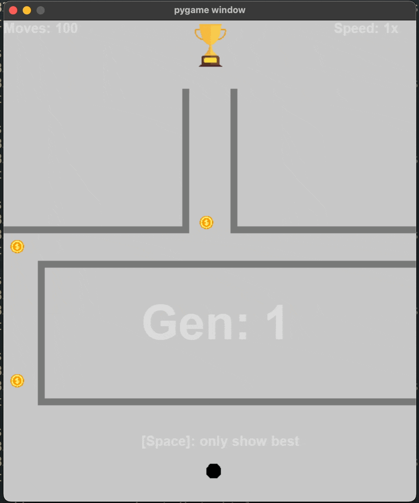

# The Genetic Algorithm

 
<hr>

## Overview

- This project leverages the genetic algorithm, which is a "heuristic" algorithm, to find the most optimal path through a some maze.
- Our population is a group of dots that are initialised with random "moves" through a 2D space.
- After each iteration, the dots that get closest to the goal is used as a parent to make babies, some being mutated in order to introduce some diversity in the search.

<hr>

## Demo

<p align="center">
  
</p>


## Setup 


- Ensure you are in the root folder: `ml-dots/`

### Automated Setup

Run the appropriate script based on your OS

- **Linux/MacOS:**
    ```bash
    ./scripts/demo.sh
    ```

- **Windows:**
    ```bash
    ./scripts/demo.bat
    ```
This script will:
1. Create a virtual environment
2. Install dependencies
3. Run `showcase.py`
4. Finally, clean up

### Manual

Alternatively, you could create & activate a virtual environment yourself (this would offer more flexibility of course).

- Create Virtual Environment
    ```bash
    python -m venv env
    ```
- Activate Virtual Environment
    ```bash
    source env/bin/activate
    ```
- Upgrade pip within the Virtual Environment
    ```bash
    pip install --upgrade pip
    ```
- Install dependencies
    ```bash
    pip install -r requirements.txt
    ```
- Run the script
    ```bash
    python showcase.py
    ```
- Deactivate Virtual Environment
    ```bash
    deactivate
    ```

## Playing with Parameters

- Playing around with various parameters is the best way to have fun with this program
- The following configurable parameters are global in `showcase.py`:
    1. **Course number (`COURSE_NUM`)**
        - I have a limited amount of courses available, some more complicated than others
    2. **Population size (`POPULATION`)**
    3. **Mutation Rate (`MUTATION_RATE`)** 
        - This specifies the chance for each move of every new child to be mutated
        - More on what this mutation is can be seen below
        - Note: Value must be a percentage, ie. A value of `5` correlates to `5%`
    4. **Starting Moves (`STARTING_MOVES`)**
        - Number of moves the dots are allowed for the first phase
    5. **Move Increments (`MOVE_INCR`)**
        - Number of moves increase after each mutation
    6. **Generation Increment (`GEN_INCR`)**
        - Number of Generations that must pass before next phase
- **Note:** You can speed up and slow down time with the up and down arrow keys

## Explanation
### Basics

- Each dot is given a list of random moves, that is stored in a list
- They then execute these moves and the best performing one, which is based on some reward function, becomes the "parent" for the next generation
- The parent then makes children and each child has the same set of moves that its parent had with some specified amount of random deviation. This leaves as with a new population of mutated children and the original parent
- The randomness introduces a form of exploration which for the most part, gets punished but sometimes gets rewarded in the form of becoming the new parent

- *WORKING PROGRESS*


  
